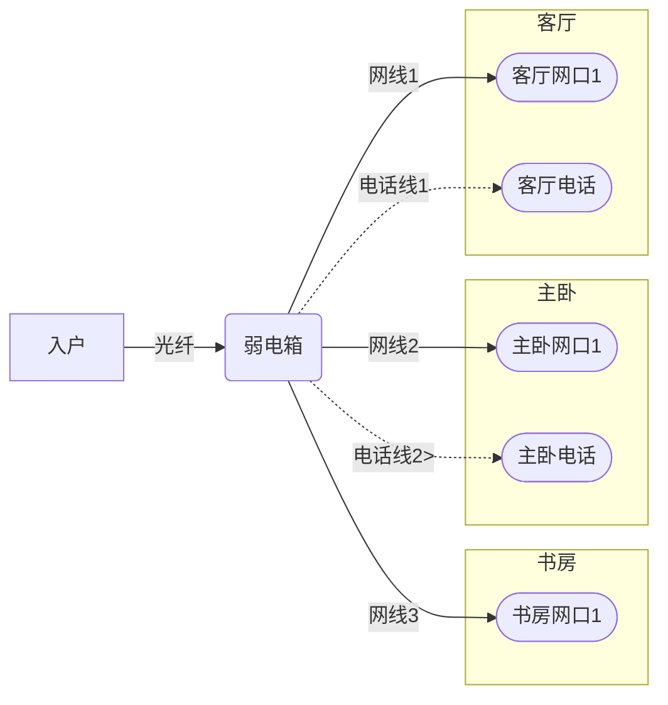
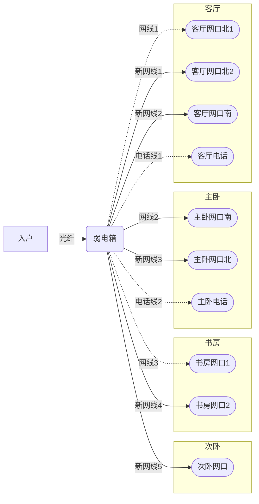
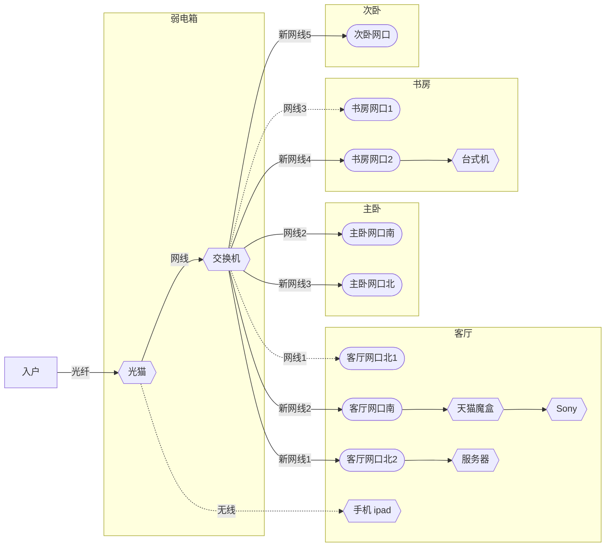
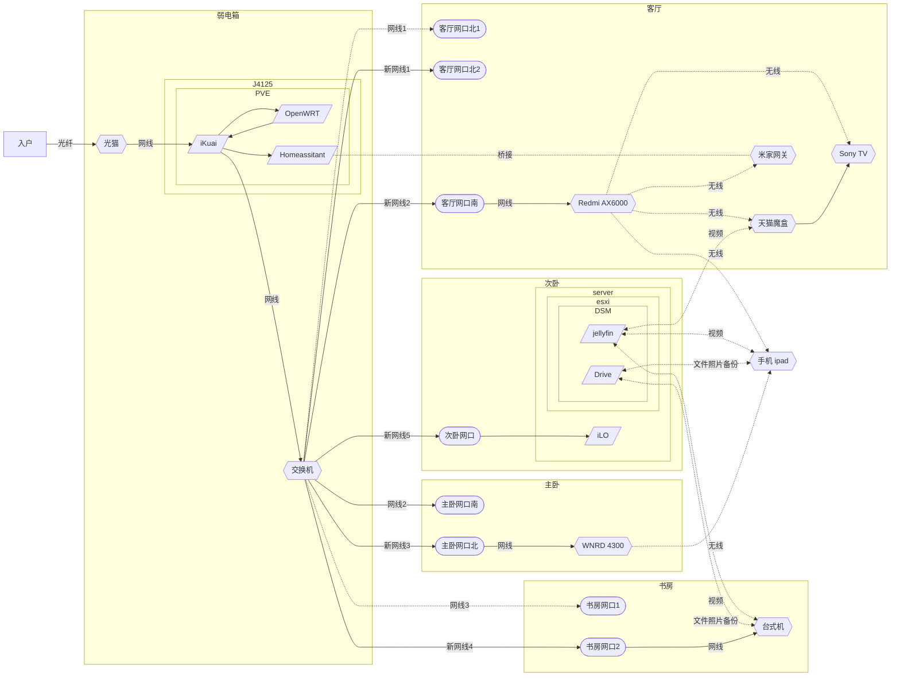

# 家庭网络

## 1.家庭原始网络布局

 交房时，已布好的网络使用的工程5类线，质量一般，网络布局见下图。

 装修时重新部秋叶原六类非屏蔽网线。
 客厅增加2条网线，主卧、次卧、书房各增加一条网线，客厅、书房网线未接网络面板，留待备用，主卧网络面板保留。电话线均保留，如有需要可抽掉更换网线。装修后网络布局见下图。

## 2.网络拓扑图V1

 新房入住后，新增加了网络设备，相应的网络拓扑图见下图。光猫开启无线功能，手机、ipad通过光猫无线上网。

## 3.网络拓扑图V2

 本次网络调整主要解决三个问题：1.无线网络覆盖；2.科学上网和外网访问；3.为今后网络拓展和智能家居打基础。

* 增加网络设备
  新增j4125工控主机、Redmi AX6000无线路由器，同时把以前的NetGear WNRD4300无线路由器重新启用。
  移动光猫改为桥接模式，关闭无线。由J4125做主路由，负责拨号。
  两个无线路由器做无线AP，负责无线设备接入，AX6000放客厅，WNRD4300放卧室，实现无线全覆盖。
  路由和无线接入分离，今后可以根据需要调整网络设备，并不需要在变更网络结构。
* 增加专用操作系统
  J4125主机安装PVE系统，PVE虚拟机安装iKuai、openwrt双路由和HomeAssistant。
  iKuai做主路由，负责pppoe拨号和内网DHCP，DHCP开启ipv6，同时开启动态域名，以便外网访问。
  openwrt做旁路由，安装科学上网插件，负责dns，安装广告拦截插件，负责广告过滤。
  HomeAssistant为后续智能家居接入做准备。
* 近期改进方案
  * 替换天猫魔盒为apple TV，作为视听中心和Homekit管理中心。
  * 升级J4125内存、硬盘，PVE虚拟机安装群晖，与服务器群晖重要资料互为备份，并常挂PT使用。
  * 服务器群晖配置一个大容量硬盘。

